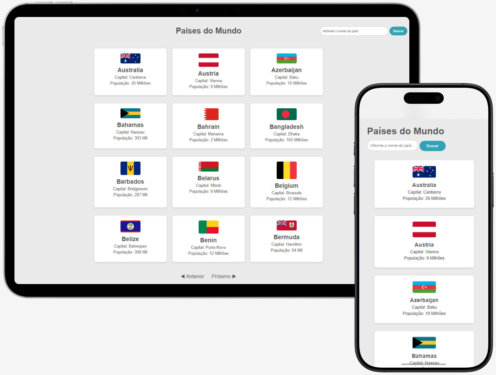

# Países do Mundo

Esta aplicação permite a consulta de informações detalhadas sobre países utilizando REST Countries API.<br> 
A aplicação combina front-end e back-end para exibir dados como capital, população e bandeira de cada país, com foco em simplicidade, desempenho e responsividade.



## Funcionalidades

- **Busca por País**: Permite buscar países pelo nome e visualizar suas principais informações.
- **Detalhes de Países**: Exibe informações como a bandeira, capital e população de cada país.
- **Ordenação Alfabética**: Lista os países em ordem alfabética.
- **Tratamento de Erros e Validações**: Validações e tratamento de erros para garantir buscas consistentes.

## Tecnologias Utilizadas

- **Front-end**: HTML e CSS.
- **Back-end**: PHP 8.3 e Laravel 11.
- **Banco de Dados**: PostgreSQL.
- **Outras Tecnologias**: Docker, Postman e REST Countries API.

## Configuração do Ambiente

Para executar o projeto localmente, siga os passos abaixo:

1. **Clone o repositório:**
   ```bash
   git clone https://github.com/anapaulaguimaraes/ConsumoApiCountries.git
   ```

2. **Entre no diretório do projeto:**
    ```bash
    cd ConsumoApiCountries
    ```

3. **Instale as dependências:**
    ```bash
    composer install
    ```

4. **Configure o arquivo .env:**<br>
    Renomeie o arquivo `.env.example` para `.env` e configure as credenciais do banco de dados.<br>
    Verifique as informações que estão sendo usadas no seu banco: endereço (`DB_HOST`), porta (`DB_PORT`), nome (`DB_DATABASE`), usuário (`DB_USERNAME`) e senha (`DB_PASSWORD`):
    ```bash
    DB_CONNECTION=pgsql
    DB_HOST=127.0.0.1
    DB_PORT=5432
    DB_DATABASE=nome_do_seu_banco
    DB_USERNAME=seu_usuario
    DB_PASSWORD=sua_senha
    ```

6. **Inicie o banco de dados com Docker Compose:**
    ```bash
    docker-compose up
    ```

7. **Crie as tabelas executando as migrações:**
    ```bash
    php artisan migrate
    ```

8. **Inicie o servidor:**<br>
     Acesse a aplicação em: http://127.0.0.1:8000
    ```bash
    php artisan serve
    ```

## Salvar Dados no Banco:

Para salvar os dados dos países no banco de dados pelo navegador ou usando o Postman:

- Navegador: Acesse `http://127.0.0.1:8000/save-countries`

- Postman: Crie uma requisição GET para `http://127.0.0.1:8000/save-countries` e clique em Send. A resposta será "Países salvos com sucesso!".

Os dados serão salvos na tabela `countries` no banco de dados.